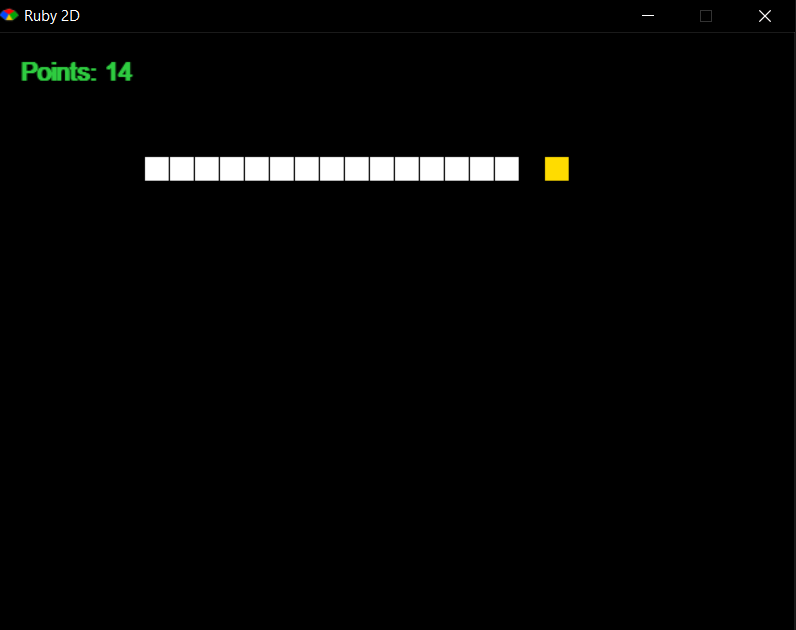

# snake
Snake project in Ruby programming language.
## Rules
In the Snake game, you are a snake, trying to eat as much apples as you can.  
You controll the snake using the arrows on your keyboard. 
If the snake hits a wall he will go through it and will re-appear in the other side. 
Every time the snake hits an apple, the snake will grow by one cube and will gain one point.  
The apple will be generated randomly on the board. 
If the snake hits itself, **you lose!**
## App.rb
The game manager - running and managing the game's objects and score count. 
The game manager handles events and enforce the games rule.
## Board.rb
Holds the class that describes the board and keep track on the player's points.
### Class Functions
* **point** - Add a point to the score count.
* **draw** - Write on the screen the player's score.
## Snake.rb
Holds the class that describes and keep the data of the snake.
### Class Functions
* **move** - Moves the snake one blok according to the snake's direction.
* **draw** - Draws the snake on the screen.
* **check_death?** - Checks if the snake hit itself.
* **location** - Returns the location of the snake's head.
## Apple.rb
Holds the clas that describes an Apple object.
### Class Functions
* **draw** - Draws the apple on the screen.
* **==(other)** - compare the location of an object(In te game the object is the snake) and checks if they are on top of each other.
## consts.rb
The consts file holds the consts that are used throughout the project.
* **GRID_SIZE** - The size of the grid - The size of every blockin the Snake game.
* **SCREEN_WIDTH** - The number of blocks that exists on the X diagnol.
* **SCREEN_HEIGHT** - The number of blocks that exists on the Y diagnol.
* **DIRECTIONS** - A list consists of the possible directions of the snake - up, down, left and right.
 

